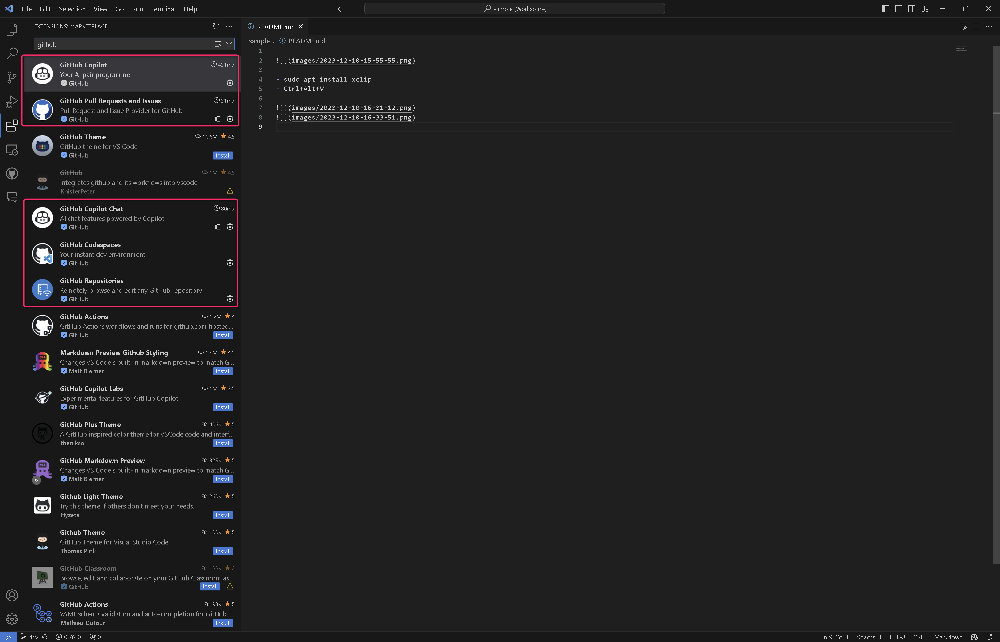
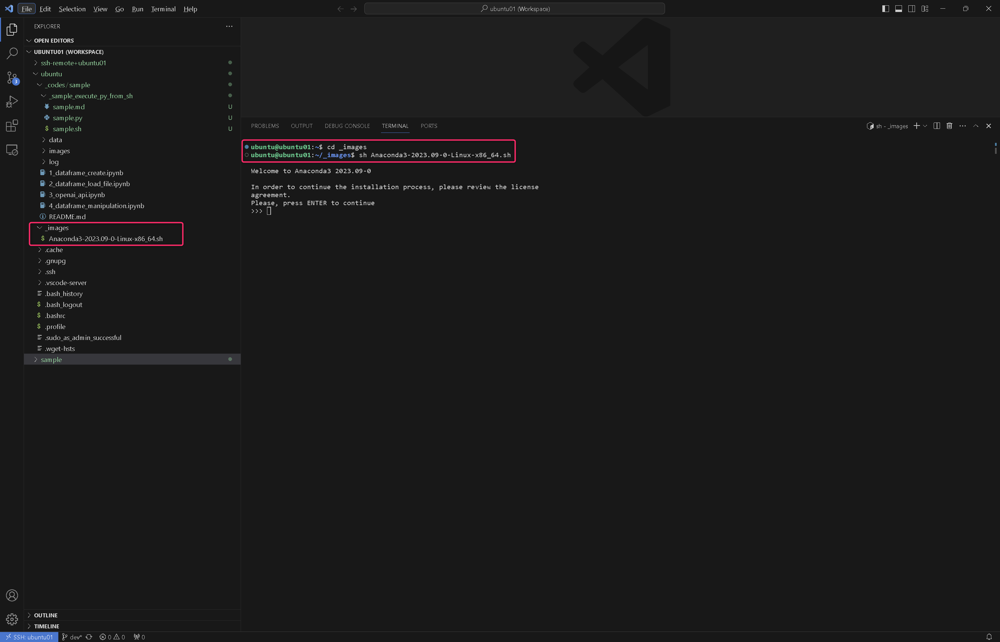
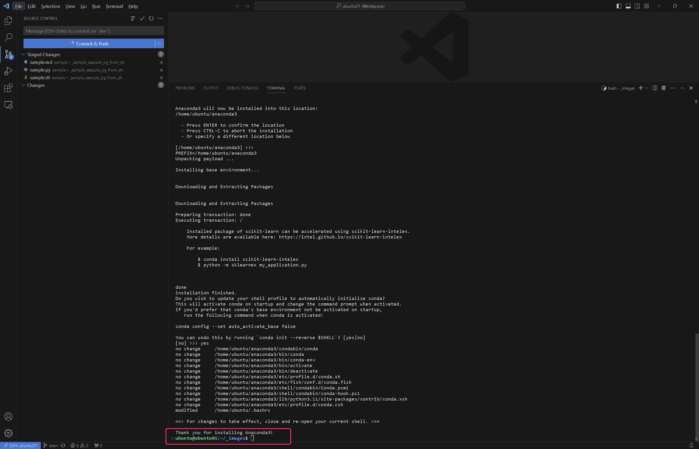

- sudo apt install xclip
- Ctrl+Alt+V

(py3.11.5) ubuntu@ubuntu01:~/anaconda3/envs/py3.11.5/bin$ ls python* -la  
lrwxrwxrwx 1 ubuntu ubuntu       10 Dec 10 07:48 python -> python3.11  
lrwxrwxrwx 1 ubuntu ubuntu       10 Dec 10 07:48 python3 -> python3.11  
lrwxrwxrwx 1 ubuntu ubuntu       10 Dec 10 07:48 python3.1 -> python3.11  
-rwxrwxr-x 1 ubuntu ubuntu 24527224 Dec 10 07:47 python3.11  
-rwxrwxr-x 1 ubuntu ubuntu     3466 Dec 10 07:47 python3.11-config  
lrwxrwxrwx 1 ubuntu ubuntu       17 Dec 10 07:48 python3-config -> python3.11-config  
(py3.11.5) ubuntu@ubuntu01:~/anaconda3/envs/py3.11.5/bin$  